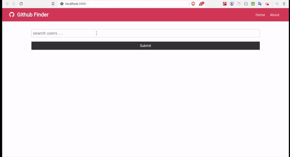
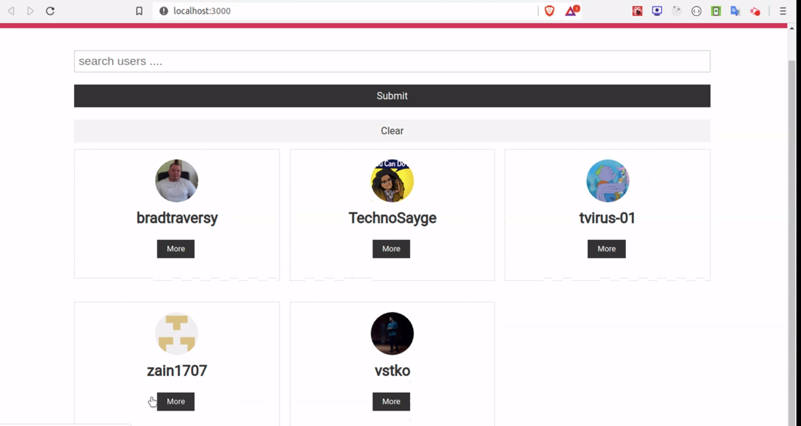
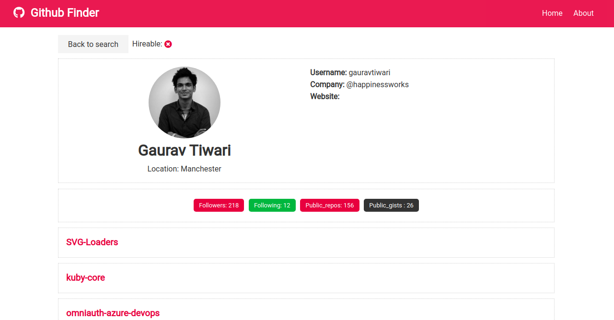

# Github Finder Application.

 <strong>Github Finder Application</strong> which basically list down all the github account with the keyword written in search bar with  the help of github API search query. 

## Tech Stack Used.

<ul>
    <li>ReactJS (Context API and Hooks)</li>
    <li>HTML</li>
    <li>CSS</li>
    <li>Github API</li>

</ul>

### Hosted on netlify:

<strong>https://githubfinder10001.netlify.app/</strong>
